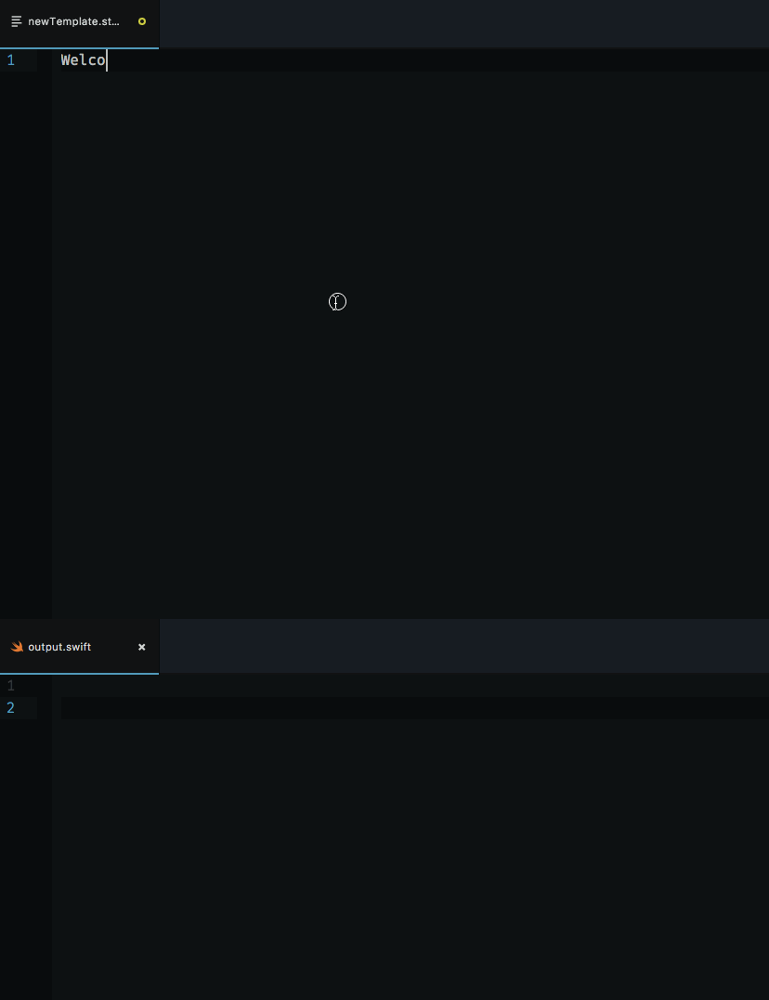

[](https://circleci.com/gh/krzysztofzablocki/Sourcery)
[](https://codecov.io/gh/krzysztofzablocki/Sourcery)
[](http://cocoapods.org/pods/Sourcery)
[](http://cocoapods.org/pods/Sourcery)
[](http://cocoapods.org/pods/Sourcery)

## What is Sourcery?
_**Sourcery** scans your source code, applies your personal templates and generates Swift code for you, allowing you to use meta-programming techniques to save time and decrease potential mistakes._


Using it offers many benefits:

- Write less repetitive code and make it easy to adhere to [DRY principle](https://en.wikipedia.org/wiki/Don't_repeat_yourself).
- It allows you to create better code, one that would be hard to maintain without it, e.g. [performing automatic property level difference in tests](https://github.com/krzysztofzablocki/Sourcery/blob/master/Sourcery/Templates/Diffable.stencil)
- Limits the risk of introducing human error when refactoring.
- Sourcery **doesn't use runtime tricks**, in fact, it allows you to leverage compiler, even more, creating more safety.
- **Immediate feedback:** Sourcery features built-in daemon support, enabling you to write your templates in real-time side-by-side with generated code.



**Sourcery is so meta that it is used to code-generate its boilerplate code**

<!-- START doctoc generated TOC please keep comment here to allow auto update -->
<!-- DON'T EDIT THIS SECTION, INSTEAD RE-RUN doctoc TO UPDATE -->
**Table of Contents**  *generated with [DocToc](https://github.com/thlorenz/doctoc)*

- [What is Sourcery?](#what-is-sourcery)
- [Why?](#why)
- [Examples](#examples)
- [Writing templates](#writing-templates)
  - [Custom Stencil tags and filter](#custom-stencil-tags-and-filter)
  - [Using Source Annotations](#using-source-annotations)
    - [Rules:](#rules)
    - [Format:](#format)
    - [Accessing in templates:](#accessing-in-templates)
- [Installing](#installing)
- [Usage](#usage)
- [Contributing](#contributing)
- [License](#license)
- [Attributions](#attributions)
- [Other Libraries / Tools](#other-libraries--tools)

<!-- END doctoc generated TOC please keep comment here to allow auto update -->

## Why?

Swift features very limited runtime and no meta-programming features. Which leads our projects to contain boilerplate code.

Sourcery exists to allow Swift developers to stop doing the same thing over and over again while still maintaining strong typing, preventing bugs and leveraging compiler.

Have you ever?

- Had to write equatable/hashable?
- Had to write NSCoding support?
- Had to implement JSON serialization?
- Wanted to use Lenses?

If you did then you probably found yourself writing repetitive code to deal with those scenarios, does this feel right?

Even worse, if you ever add a new property to a type all of those implementations have to be updated, or you will end up with bugs.
In those scenarios usually **compiler will not generate the error for you**, which leads to error prone code.

## Examples

##### Use case: `I want to know how many elements are in each enum`
Template:
```swift

extension {{ enum.name }} {
  static var count: Int { return {{ enum.cases.count }} }
}

```

Result:

```swift
extension AdType {
  static var count: Int { return 2 }
}

...
```

----

##### Use case: `I want to generate Equality for types implementing AutoEquatable.`

Template:

```swift

extension {{ type.name }}: Equatable {}

func == (lhs: {{ type.name }}, rhs: {{ type.name }}) -> Bool {
     if lhs.{{ variable.name }} != rhs.{{ variable.name }} { return false }
    
    return true
}

```

Result:

```swift
extension AccountSectionConfiguration: Equatable {}

func == (lhs: AccountSectionConfiguration, rhs: AccountSectionConfiguration) -> Bool {
     if lhs.status != rhs.status { return false }
     if lhs.user != rhs.user { return false }
     if lhs.entitlements != rhs.entitlements { return false }

    return true
}
...

```

----

##### Use case: `I want to create lenses for all structs.`
_[Full implementation](http://gist.github.com/FilipZawada/934397bbef58e529762aff571a59d9b0)_

Template:

```stencil

extension {{ type.name }} {

  static let {{ variable.name }}Lens = Lens<{{type.name}}, {{variable.type}}>(
    get: { $0.{{variable.name}} },
    set: { {{variable.name}}, {{type.name | lowercase}} in
       {{type.name}}({{argument.name}}: {{variable.name}}{{type.name || lowercase}}.{{argument.name}}, )
    }
  )
}

```

Result:

```swift
extension House {

  static let addressLens = Lens<House, String>(
    get: { $0.address },
    set: { address, house in
       House(rooms: house.rooms, address: address, size: house.size)
    }
  )

  ...
}
```

## Writing templates
*Sourcery templates are powered by [Stencil](https://github.com/kylef/Stencil)*

Make sure you leverage Sourcery built-in daemon to make writing templates a pleasure:
you can open template side-by-side with generated code and see it change live.

There are multiple ways to access your types:

- `type.TypeName` => access specific type by name
- `types.all` => all types, excluding protocols
- `types.classes`
- `types.structs`
- `types.enums`
- `types.protocols` => lists all protocols (that were defined in the project)
- `types.inheriting.BaseClass` => lists all types inherting from known BaseClass (only those that were defined in source code that Sourcery scanned)
- `types.implementing.Protocol` => lists all types conforming to given Protocol (only those that were defined in source code that Sourcery scanned)
- `types.based.BaseClassOrProtocol` => lists all types implementing or inheriting from `BaseClassOrProtocol` (all type names encountered, even those that Sourcery didn't scan)

All of these properties return `Type` objects.

Available types:

<details><summary>**Type**. Properties:</summary>

- `name` <- name
- `kind` <- convience accessor that will contain one of `enum`, `class`, `struct`, `protocol`, it will also provide `extension` for types that are unknown to us(e.g. 3rd party or objc), but had extension in the project
- `isGeneric` <- info whether the type is generic
- `localName` <- name within parent scope
- `variables` <- list of all variables defined in this type, excluding variables from protocols or inheritance
  - if you want to access all available variables, including those from inherited / protocol, then use `allVariables`
  - if you want to accces computed, stored, instance, or static variables, you can do so using our [custom filters](#custom-stencil-tags-and-filter) on both `variables` and `allVariables`
- `methods` <- list of all methods defined in this type, excluding those from protocols or inheritance
- `allMethods` <- same principles as in `allVariables`
- `initializers` <- list of all initializers
- `inherits.BaseClass` => info whether type inherits from known base class
- `implements.Protocol` => info whether type implements known protocol
- `based.BaseClassOrProtocol` => info whether type implements or inherits from `BaseClassOrProtocol` (all type names encountered, even those that Sourcery didn't scan)
- `containedTypes` <- list of types contained within this type
- `parentName` <- list of parent type (for contained ones)
- `attributes` <- type attributes, i.e. `type.attributes.objc`
- `annotations` <- dictionary with configured [annotations](#source-annotations)

</details>

<details><summary> **Enum**. Built on top of `Type` and provides some additional properties:</summary>

- `rawType` <- enum raw type
- `cases` <- list of `Enum.Case`
- `hasAssociatedValues` <- true if any of cases has associated values

</details>

<details><summary>**Enum.Case**. Properties:</summary>

- `name` <- name
- `rawValue` <- raw value
- `associatedValues` <- list of `AssociatedValue`
- `annotations` <- dictionary with configured [annotations](#source-annotations)

</details>

<details><summary>**Enum.Case.AssociatedValue**. Properties:</summary>

- `localName` <- name to use to construct value, i.e. `value` in `Foo.foo(value: ...)`
- `externalName` <- name to use when binding value, i.e. `value` or `other` in `enum Foo { case foo(value: ..., other: ... )}`. Will use index as a fallback
- `typeName` <- name of type of associated value (*TypeName*)
- `actualTypeName` <- returns `typeName.actualTypeName` or if it's `nil` returns `typeName`
- `unwrappedTypeName` <- shorthand for `typeName.unwrappedTypeName`
- `isOptional` <- shorthand for `typeName.isOptional`
- `isImplicitlyUnwrappedOptional` <- shorthand for `typeName. isImplicitlyUnwrappedOptional `
- `isTuple` <- shorthand for `typeName.isTuple`

</details>

<details><summary>**Variable**. Properties:</summary>

- `name` <- Name
- `type` <- type of the variable, if known
- `typeName` <- returns name of the type (*TypeName*)
- `actualTypeName` <- returns `typeName.actualTypeName` or if it's `nil` returns `typeName`
- `unwrappedTypeName` <- shorthand for `typeName.unwrappedTypeName`
- `isOptional` <- shorthand for `typeName.isOptional`
- `isImplicitlyUnwrappedOptional` <- shorthand for `typeName. isImplicitlyUnwrappedOptional `
- `isComputed` <- whether is computed
- `isStatic` <- whether is static variable
- `isTuple` <- shorthand for `typeName.isTuple`
- `typeName.tuple` <- returns information about tuple type
- `readAccess` <- what is the protection access for reading?
- `writeAccess` <- what is the protection access for writing?
- `attributes` <- variable attributes, i.e. `var.attributes.NSManaged`
- `annotations` <- dictionary with configured [annotations](#source-annotations)

</details>

<details><summary>**Method**. Properties:</summary>

- `selectorName` <- full name of the method, i.e for `func foo(bar: Bar) -> Bar` `foo(bar:)`
- `shortName` <- short method name, i.e. for `func foo(bar: Bar) -> Bar` `foo`
- `parameters` <- list of all method parameters
- `returnType` <- return type, if known, for initializers - containing type
- `returnTypeName` <- return type name (*TypeName*). Will be `Void` for methods without return value or empty string for initializers.
- `unwrappedReturnTypeName` <- shorthand for `returnTypeName.unwrappedTypeName`
- `isOptionalReturnType` <- shorthand for `returnTypeName.isOptional`
- `isImplicitlyUnwrappedOptionalReturnType` <- shorthand for `returnTypeName. isImplicitlyUnwrappedOptional`
- `accessLevel` <- method access level
- `isStatic` <- whether method is static
- `isClass` <- whether method is class (can be overriden by subclasses)
- `isInitializer` <- whether method is an initializer
- `isFailableInitializer` <- whether method is failable initializer
- `attributes` <- method attributes, i.e. `method.attributes.discardableResult`
- `annotations` <- dictionary with configured [annotations](#source-annotations)

</details>

<details><summary>**Method.Parameter**. Properties:</summary>

- `name` <- parameter name
- `argumentLabel` <- argument label (external name), if not set will be eqal to `name`
- `type` <- type of parameter, if known
- `typeName` <- parameter type name (*TypeName*)
- `actualTypeName` <- returns `typeName.actualTypeName` or if it's `nil` returns `typeName`
- `unwrappedTypeName` <- shorthand for `typeName.unwrappedTypeName`
- `isOptional` <- shorthand for `typeName.isOptional`
- `isImplicitlyUnwrappedOptional` <- shorthand for `typeName. isImplicitlyUnwrappedOptional `
- `isTuple` <- shorthand for `typeName.isTuple`
- `typeAttributes` <- parameter's type attributes, shorthand for `typeName.attributes`, i.e. `param.typeAttributes.escaping`

</details>

<details><summary>**TypeName**. Properties:</summary>

- `name` <- type name
- `actualTypeName` <- if given type is a typealias will contain actual type name
- `unwrappedTypeName` <- returns name of the type, unwrapping the optional e.g. for variable with type `Int?` this would return `Int`
- `isOptional` <- whether is optional
- `isImplicitlyUnwrappedOptional` <- whether is implicitly unwrapped optional
- `isVoid` <- whether type is Void (`Void` or `()`)
- `isTuple` <- whether given type is a tuple
- `tuple.elements` <- if given type is a tuple returns its elements information (*TupleType.Element*)
- `attributes` <- type attributes, i.e. `typeName.attributes.escaping`

</details>

<details><summary>**TupleType.Element**. Properties:</summary>

- `name` <- element name
- `type` <- type of element, if known
- `typeName` <- element type name (*TypeName*)
- `unwrappedTypeName` <- shorthand for `typeName.unwrappedTypeName`
- `isOptional` <- shorthand for `typeName.isOptional`
- `isTuple` <- shorthand for `typeName.isTuple`

</details>

### Custom Stencil tags and filter

- `{{ name|upperFirst }}` - makes first letter in `name` uppercase
- `` - check if `name` contains arbitrary substring, can be negated with `!` prefix.
- ``- check if `name` starts with arbitrary substring, can be negated with `!` prefix.
- ``- check if `name` ends with arbitrary substring, can be negated with `!` prefix.
- `static`, `instance`, `computed`, `stored`, `tuple` - can be used on Variable[s] as filter e.g. ``, can be negated with `!` prefix.
- `static`, `instance`, `class`, `initializer` - can be used on Method[s] as filter e.g. ``, can be negated with `!` prefix.
- `enum`, `class`, `struct`, `protocol` - can be used for Type[s] as filter, can be negated with `!` prefix.
- `based`, `implements`, `inherits` - can be used for Type[s], Variable[s], Associated value[s], can be negated with `!` prefix.
- `count` - can be used to get count of filtered array
- `annotated` - can be used on Type[s], Variable[s], Method[s] and Enum Case[s] to filter by annotation, e.g. ``, can be negated with `!` prefix.

### Using Source Annotations

Sourcery supports annotating your classes and variables with special annotations, similar how attributes work in Rust / Java

```swift
/// sourcery: skipPersistence
/// Some documentation comment
/// sourcery: anotherAnnotation = 232, yetAnotherAnnotation = "value"
/// Documentation
var precomputedHash: Int
```

If you want to attribute multiple items with same attributes, you can use section annotations:
```swift
/// sourcery:begin: skipEquality, skipPersistence
  var firstVariable: Int
  var secondVariable: Int
/// sourcery:end
```

#### Rules:

- Multiple annotations can occur on the same line
- You can add multiline annotations
- You can interleave annotations with documentation
- Sourcery scans all `sourcery:` annotations in the given comment block above the source until first non-comment/doc line

#### Format:

- simple entry, e.g. `sourcery: skipPersistence`
- key = number, e.g. `sourcery: another = 123`
- key = string, e.g. `sourcery: jsonKey = "json_key"`

#### Accessing in templates:

```swift

  var local{{ variable.name|capitalize }} = json["{{ variable.annotations.jsonKey }}"] as? {{ variable.typeName }}

```

## Installing

<details>
<summary>Binary form</summary>
The easiest way to download the tool right now is to just grab a newest `.zip` distribution from [releases tab](https://github.com/krzysztofzablocki/Sourcery/releases).
</details>

<details>
<summary>Via CocoaPods</summary>
If you're using CocoaPods, you can simply add pod 'Sourcery' to your Podfile.

This will download the Sourcery binaries and dependencies in `Pods/`.
You just need to add `$PODS_ROOT/Sourcery/bin/sourcery {source} {templates} {output}` in your Script Build Phases.
</details>

<details>
<summary>Via Swift Package Manager</summary>
If you're using SwiftPM, you can simply add 'Sourcery' to your manifest.

Sourcery is placed in `Packages`.
After your first `swift build`, you can run `.build/debug/sourcery {source} {templates} {output}`.
</details>

<details>
<summary>From Source</summary>
You can clone it from the repo and just run `Sourcery.xcworkspace`.
</details>

## Usage
Sourcery is a command line tool `sourcery`:
```
$ ./sourcery <source> <templates> <output> [--args arg1=value,arg2]
```
Arguments:

- source - Path to a source swift files.
- templates - Path to templates. File or Directory.
- output - Path to output. File or Directory.
- args - Additional arguments to pass to templates. Each argument can have explicit value or will have implicit `true` value. Arguments should be separated with `,` without spaces. Arguments are accessible in templates via `argument.name`

Options:

- `--watch` [default: false] - Watch both code and template folders for changes and regenerate automatically.
- `--verbose` [default: false] - Turn on verbose logging for ignored entities

## Contributing

Contributions to Sourcery are welcomed and encouraged!

It is easy to get involved. Please see the [Contributing guide](CONTRIBUTING.md) for more details.

[A list of contributors is available through GitHub.](https://github.com/krzysztofzablocki/Sourcery/graphs/contributors)

To give clarity of what is expected of our community, Sourcery has adopted the code of conduct defined by the Contributor Covenant. This document is used across many open source communities, and I think it articulates my values well. For more, see the [Code of Conduct](CODE_OF_CONDUCT.md).

## License

Sourcery is available under the MIT license. See [LICENSE](LICENSE) for more information.

## Attributions

This tool is powered by

- [SourceKitten](https://github.com/jpsim/SourceKitten) by [JP Simard](https://github.com/jpsim)
- [Stencil](https://github.com/kylef/Stencil) and few other libs by [Kyle Fuller](https://github.com/kylef)

Thank you! for:

- [Mariusz Ostrowski](http://twitter.com/faktory) for creating the logo.
- [Artsy Eidolon](https://github.com/artsy/eidolon) team, because we use their codebase as a stub data for performance testing the parser.
- [Olivier Halligon](https://github.com/AliSoftware) for showing me his setup scripts for CLI tools which are powering our rakefile.

## Other Libraries / Tools

If you want to generate code for asset related data like .xib, .storyboards etc. use [SwiftGen](https://github.com/AliSoftware/SwiftGen). SwiftGen and Sourcery are complementary tools.

Make sure to check my other libraries and tools, especially:
- [KZPlayground](https://github.com/krzysztofzablocki/KZPlayground) - Powerful playgrounds for Swift and Objective-C
- [KZFileWatchers](https://github.com/krzysztofzablocki/KZFileWatchers) - Daemon for observing local and remote file changes, used for building other developer tools (Sourcery uses it)

You can [follow me on twitter][1] for news/updates about other projects I am creating.

 [1]: http://twitter.com/merowing_
