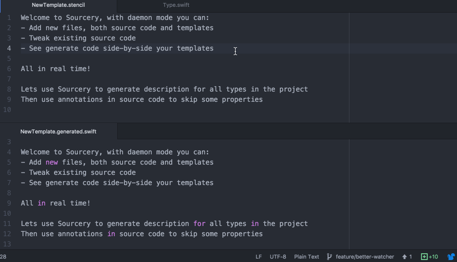

[](https://circleci.com/gh/krzysztofzablocki/Sourcery)
[](https://codecov.io/gh/krzysztofzablocki/Sourcery)
[](http://cocoapods.org/pods/Sourcery)
[](http://cocoapods.org/pods/Sourcery)
[](http://cocoapods.org/pods/Sourcery)


### What is Sourcery?

Swift is a beautiful language that powers a lot of great iOS apps. Unfortunately it features very limited runtime and no meta-programming features.

This has led our projects to contain a lot of duplicated code patterns, they can be considered the same code, just with minimal variations.

Sourcery has been created to allow Swift developers to stop doing the same thing over and over again.
It allows us to have meta-programming while still maintaning strong typing, preventing bugs and leveraging compiler.
<br><br>

Have you ever?

- Had to write NSCoding support?
- Had to implement JSON serialization?
- Wanted value types to be equatable and hashable?
- Used enum to wrap decoupled types?

If you did then you probably found yourself writing a lot of repetitive code to deal with those scenarios, does this feel right?

Even worse, if you ever add a new property to a type all of those implementations have to be updated, or you'll end up with bugs.
In those scenarios usually **compiler won't generate the error for you**, which leads to error prone code.

_**Sourcery** is a tool that scans your source code, applies your personal templates and generates Swift code for you, allowing you to use meta-programming techniques to save time and decrease potential mistakes._

- Scans your project code.
- [Adds code annotations](#source-annotations), think attributes like in Rust
- Allows your templates to access information about project types.
- Generates swift code.
- **Immediate feedback:** Sourcery features built-in daemon support, allowing you to write your templates in real-time side-by-side with generated code.

There are multiple benefits in using Sourcery approach:

- Write less boilerplate code and make it easy adhere to [DRY principle](https://en.wikipedia.org/wiki/Don't_repeat_yourself)
- Avoid the risk of forgetting to update boilerplate when refactoring
- Gives you meta-programming powers, while still allowing the compiler to ensure everything is correct.
- **Sourcery is so meta that it is used to code-generate its own boilerplate code**

Daemon mode in action:



How everything connects:

```bash

                                   +--------------+
         Scans code to build AST   |              |  Generates new code
      +---------------------------->   SOURCERY   +--------------------------------+
      |                            |              |                                |
      |                            +--^--------^--+                                |
      |                               |        |                                   |
      |                               |        | Reads templates                   |
      |                               |        |                                   |
+-----+------+       +----------------+--+  +--+----------------+        +---------v---------+
|            |       |                   |  |                   |        |                   |
|   Source   |       | Equality Template |  | NSCoding Template |        |  Generated Swift  |
|            |       |                   |  |                   |        |                   |
+-----^------+       +-------------------+  +-------------------+        +-------------------+
      |                                                                            |
      |                                                                            |
      |                                                                            |
      +----------------------------------------------------------------------------+
                              Compiled into your project

```

## Examples

##### Use case: `I want to know how many elements are in each enum`
Template:
```swift

extension {{ enum.name }} {
  static var count: Int { return {{ enum.cases.count }} }
}

```

Result:

```swift
extension AdType {
  static var count: Int { return 2 }
}
```

----

##### Use case: `I want to generate Equality for types implementing specific protocol.`

Template:

```swift

extension {{ type.name }}: Equatable {}

func == (lhs: {{ type.name }}, rhs: {{ type.name }}) -> Bool {
     if lhs.{{ variable.name }} != rhs.{{ variable.name }} { return false }
    
    return true
}

```

Result:
```swift
extension AccountSectionConfiguration: Equatable {}

func == (lhs: AccountSectionConfiguration, rhs: AccountSectionConfiguration) -> Bool {
     if lhs.status != rhs.status { return false }
     if lhs.user != rhs.user { return false }
     if lhs.entitlements != rhs.entitlements { return false }

    return true
}
```

##### Use case: `I want to list all computed variables in a given type.`

Template:

```swift
 {{ variable.name }}: {{ variable.type }}

```

Result:
```swift
attributedTitle: NSAttributedString
attributedKicker: NSAttributedString
attributedHeadline: NSAttributedString
attributedSummary: NSAttributedString
```


##### Use case: `I want to create lenses helpers for all structs.`
_[Full implementation](gist.github.com/FilipZawada/934397bbef58e529762aff571a59d9b0)_

Template:

```stencil

extension {{ type.name }} {

  static let {{ variable.name }}Lens = Lens<{{type.name}}, {{variable.type}}>(
    get: { $0.{{variable.name}} },
    set: { {{variable.name}}, {{type.name | lowercase}} in
       {{type.name}}({{argument.name}}: {{variable.name}}{{type.name || lowercase}}.{{argument.name}}, )
    }
  )
}

```

Result:
```swift

extension House {

  static let addressLens = Lens<House, String>(
    get: { $0.address },
    set: { address, house in
       House(rooms: house.rooms, address: address, size: house.size)
    }
  )

  ...
}
```

## Writing templates
*Sourcery templates are powered by [Stencil](https://github.com/kylef/Stencil)*

Make sure you leverage Sourcery built-in daemon to make writing templates a pleasure:
you can open template side-by-side with generated code and see it change live.

There are multiple ways to access your types:

- `type.TypeName` => access specific type by name
- `types.all` => all types, excluding protocols
- `types.classes`
- `types.structs`
- `types.enums`
- `types.protocols` => lists all protocols (that were defined in the project)
- `types.inheriting.BaseClass` => lists all types inherting from known BaseClass (only those that were defined in source code that Sourcery scanned)
- `types.implementing.Protocol` => lists all types conforming to given Protocol (only those that were defined in source code that Sourcery scanned)
- `types.based.BaseClassOrProtocol` => lists all types implementing or inheriting from `BaseClassOrProtocol` (all type names encountered, even those that Sourcery didn't scan)

For each type you can access following properties:

- `name` <- name
- `kind` <- convience accessor that will contain one of `enum`, `class`, `struct`, `protocol`, it will also provide `extension` for types that are unknown to us(e.g. 3rd party or objc), but had extension in the project
- `isGeneric` <- info whether the type is generic
- `localName` <- name within parent scope
- `staticVariables` <- list of static variables
- `variables` <- list of instance variables
- `computedVariables` <- list of computed instance variables
- `storedVariables` <- list of computed stored variables
- `inherits.BaseClass` => info whether type inherits from known base class
- `implements.Protocol` => info whether type implements known protocol
- `based.BaseClassOrProtocol` => info whether type implements or inherits from `BaseClassOrProtocol` (all type names encountered, even those that Sourcery didn't scan)
- `containedTypes` <- list of types contained within this type
- `parentName` <- list of parent type (for contained ones)
- `annotations` <- dictionary with configured [annotations](#source-annotations)

**Enum** types builts on top of regular types and adds:

- `rawType` <- enum raw type
- `cases` <- list of `Enum.Case`
- `hasAssociatedValues` <- true if any of cases has associated values

**Enum.Case** provides:

- `name` <- name
- `rawValue` <- raw value
- `associatedValues` <- list of `AssociatedValue`
- `annotations` <- dictionary with configured [annotations](#source-annotations)

**Enum.Case.AssociatedValue** provides:

- `name` <- name
- `typeName` <- name of type of associated value

**Variable** provides:

- `name` <- Name
- `type` <- type of the variable
- `typeName` <- returns name of the type, including things like optional markup
- `unwrappedTypeName` <- returns name of the type, unwrapping the optional e.g. for variable with type `Int?` this would return `Int`
- `isOptional` <- whether is optional
- `isComputed` <- whether is computed
- `isStatic` <- whether is static variable
- `readAccess` <- what is the protection access for reading?
- `writeAccess` <- what is the protection access for writing?
- `annotations` <- dictionary with configured [annotations](#source-annotations)


## Source Annotations

Sourcery supports annotating your classes and variables with special annotations, similar how attributes work in Rust / Java

```swift
/// sourcery: skipPersistence
/// Some documentation comment
/// sourcery: anotherAnnotation = 232, yetAnotherAnnotation = "value"
/// Documentation
var precomputedHash: Int
```

If you want to attribute multiple items with same attributes, you can use section annotations:
```swift
/// sourcery:begin: skipEquality, skipPersistence
  var firstVariable: Int
  var secondVariable: Int
/// sourcery:end
```

#### Features:

- Multiple annotations can occur on the same line
- Multiline annotations are supported
- You can interleave annotations with documentation
- Sourcery will scan all `sourcery:` annotations in the given comment block above the source until first non comment/doc line

#### Format:

- simple entry, e.g. `sourcery: skipPersistence`
- key = number, e.g. `sourcery: another = 123`
- key = string, e.g. `sourcery: jsonKey = "json_key"`

#### Accessing in templates:

```swift

  var local{{ variable.name|capitalize }} = json["{{ variable.annotations.jsonKey }}"] as? {{ variable.typeName }}

```

# Installing

## Installation

<details>
<summary>Binary form</summary>
The easiest way to download the tool right now is to just grab a newest `.zip` distribution from [releases tab](https://github.com/krzysztofzablocki/Sourcery/releases).
</details>

<details>
<summary>Via CocoaPods</summary>
If you're using CocoaPods, you can simply add pod 'Sourcery' to your Podfile.

This will download the Sourcery binaries and dependencies in `Pods/`.
You just need to add `$PODS_ROOT/Sourcery/bin/sourcery {source} {templates} {output}` in your Script Build Phases.
</details>

<details>
<summary>Via Swift Package Manager</summary>
If you're using SwiftPM, you can simply add 'Sourcery' to your manifest.

Sourcery will be placed in `Packages`.
After your first `swift build`, you can run `.build/debug/Sourcery {source} {templates} {output}`.
</details>

<details>
<summary>From Source</summary>
You can clone it from the repo and just run `Sourcery.xcworkspace`.
</details>

## Usage
Sourcery is a command line tool `sourcery`:
```
$ ./sourcery <source> <templates> <output>
```
Arguments:

- source - Path to a source swift files.
- templates - Path to templates. File or Directory.
- output - Path to output. File or Directory.

Options:

- `--watch` [default: false] - Watch template for changes and regenerate as needed. Only works with specific template path (not directory).
- `--verbose` [default: false] - Turn on verbose logging for ignored entities

## Contributing

Contributions to Sourcery are welcomed and encouraged!

It's easy to get involved, please see the [Contributing guide](CONTRIBUTING.md) for more details.

[A list of contributors is available through GitHub.](https://github.com/krzysztofzablocki/Sourcery/graphs/contributors)

To give clarity of what is expected of our community, Sourcery has adopted the code of conduct defined by the Contributor Covenant. This document is used across many open source communities, and I think it articulates my values well. For more, see the [Code of Conduct](CODE_OF_CONDUCT.md).

## License

Sourcery is available under the MIT license. See [LICENSE](LICENSE) for more information.

# Attributions

This tool is powered by

- [SourceKitten](https://github.com/jpsim/SourceKitten) by [JP Simard](https://github.com/jpsim)
- [Stencil](https://github.com/kylef/Stencil) and few other libs by [Kyle Fuller](https://github.com/kylef)

[Olivier Halligon](https://github.com/AliSoftware) pointed me to few of his setup scripts for CLI tools, very helpful, thank you!

# Other Libraries / Tools

If you want to generate code for asset related logic, I highly recommend [SwiftGen](https://github.com/AliSoftware/SwiftGen)

Make sure to check my other libraries and tools, especially:
- [KZPlayground](https://github.com/krzysztofzablocki/KZPlayground) - Powerful playgrounds for Swift and Objective-C
- [KZFileWatchers](https://github.com/krzysztofzablocki/KZFileWatchers) - Daemon for observing local and remote file changes, used for building other developer tools (Sourcery uses it)

You can [follow me on twitter][1] for news / updates about other projects I'm creating.

 [1]: http://twitter.com/merowing_
